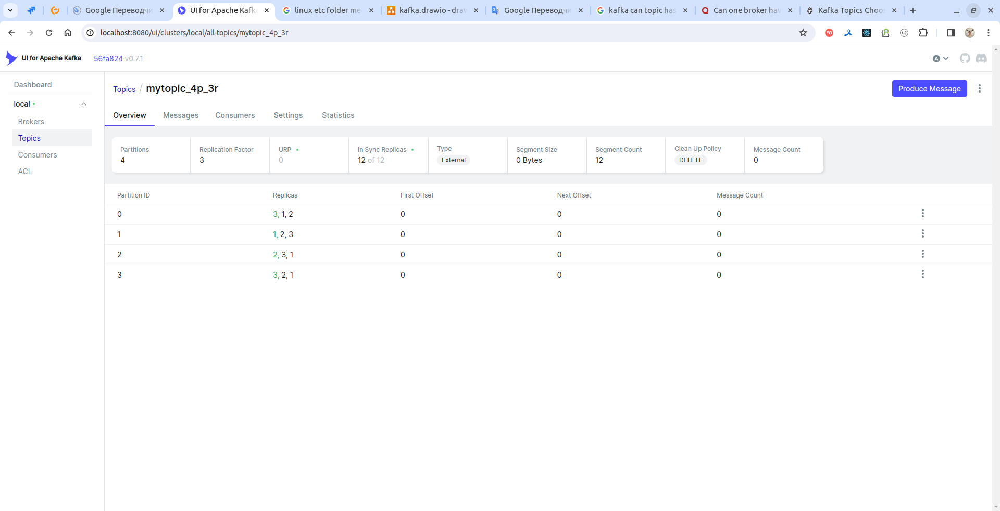
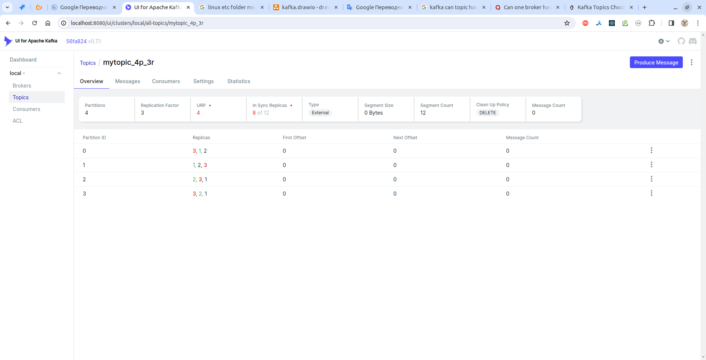

### The default Kafka ecosystem ports

| Service                                                | Default Port | Container environment variable |
|--------------------------------------------------------|--------------|--------------------------------|
| Kafka Clients listeners connections port*              | 9092         | KAFKA_LISTENERS                |
| Kafka private communication port (Control Plane)       | 9093         | KAFKA_LISTENERS                |
| "Kafka Connect" service port                           | 8083         |                                |
| ZooKeeper external client connections port             | 2181         |                                |     
| ZooKeeper peers (leader-worker) connections port       | 2888         |                                |
| ZooKeeper host election (node-to-node) port            | 3888         |                                |
| Kafka Schema Registry connection port                  | 8081         |                                |
| REST Proxy (RESTful interface) to Apache Kafka cluster | 8082         |                                |    
| ksqlDB                                                 | 8088         |                                |


### Kafka Docker parameters

| Parameter                        | Comment                                                        | Container environment variable             | Broker-1                                                         | Broker-2                                                         | Broker-3                                                         |
|----------------------------------|----------------------------------------------------------------|--------------------------------------------|------------------------------------------------------------------|------------------------------------------------------------------|------------------------------------------------------------------|
| broker.id                        |                                                                | KAFKA_BROKER_ID                            | 1                                                                | 2                                                                | 3                                                                |
| zookeeper.connect                |                                                                | KAFKA_ZOOKEEPER_CONNECT                    | zookeeper-1:2181                                                 | zookeeper-1:2181                                                 | zookeeper-1:2181                                                 |
| jmx.port                         |                                                                | KAFKA_JMX_PORT                             | 9997                                                             | 9997                                                             | 9997                                                             |
| listeners                        | initial connection protocol->port (Kafka binds to and listens) | KAFKA_LISTENERS                            | PLAINTEXT://kafka-broker-1:29092,PLAINTEXT_HOST://localhost:9072 | PLAINTEXT://kafka-broker-2:29092,PLAINTEXT_HOST://localhost:9082 | PLAINTEXT://kafka-broker-3:29092,PLAINTEXT_HOST://localhost:9092 |
| advertised.listeners             | working connection port (metadata passed back to clients)      | KAFKA_ADVERTISED_LISTENERS                 | PLAINTEXT://kafka-broker-1:29092,PLAINTEXT_HOST://localhost:9072 | PLAINTEXT:PLAINTEXT,PLAINTEXT_HOST:PLAINTEXT                     | PLAINTEXT:PLAINTEXT,PLAINTEXT_HOST:PLAINTEXT                     |
| listener.security.protocol.map   | key/value pairs for the security protocol to use per listener  | KAFKA_LISTENER_SECURITY_PROTOCOL_MAP       | PLAINTEXT:PLAINTEXT,PLAINTEXT_HOST:PLAINTEXT                     | PLAINTEXT                                                        | PLAINTEXT                                                        |
| inter.broker.listener.name       | inter-broker connection method                                 | KAFKA_INTER_BROKER_LISTENER_NAME           | PLAINTEXT                                                        |                                                                  |                                                                  |
| log.dirs                         |                                                                |                                            | /var/lib/kafka/data                                              | /var/lib/kafka/data                                              | /var/lib/kafka/data                                              |
| offsets.topic.replication.factor |                                                                | KAFKA_OFFSETS_TOPIC_REPLICATION_FACTOR     | 1                                                                | 1                                                                | 1                                                                |
| ssl.keystore.location            |                                                                | KAFKA_SSL_KEYSTORE_FILENAME                | keystore_filename                                                |                                                                  |                                                                  |
| ssl.keystore.credentials         |                                                                | KAFKA_SSL_KEYSTORE_CREDENTIALS             | keystore_credentials                                             |                                                                  |                                                                  |
| ssl.key.credentials              |                                                                | KAFKA_SSL_KEY_CREDENTIALS                  | key_credentials                                                  |                                                                  |                                                                  |
| ssl.truststore.location          |                                                                | KAFKA_SSL_TRUSTSTORE_FILENAME              | truststore_filename                                              |                                                                  |                                                                  |
| ssl.truststore.credentials       |                                                                | KAFKA_SSL_TRUSTSTORE_CREDENTIALS           | truststore_credentials                                           |                                                                  |                                                                  |
| security.inter.broker.protocol   |                                                                | KAFKA_SECURITY_INTER_BROKER_PROTOCOL       | inter_broker_protocol                                            |                                                                  |                                                                  |
|                                  |                                                                | KAFKA_SASL_MECHANISM_INTER_BROKER_PROTOCOL | sasl_mechanism_inter_broker_protocol                             |                                                                  |                                                                  |
|                                  |                                                                | KAFKA_SASL_ENABLED_MECHANISMS              | sasl_enabled_mechanism                                           |                                                                  |                                                                  |
|                                  |                                                                | KAFKA_SASL_KERBEROS_SERVICE_NAME           | sasl_kerberos_service                                            |                                                                  |                                                                  |
|                                  |                                                                | KAFKA_OPTS                                 | opts                                                             |                                                                  |                                                                  |
|                                  |                                                                |                                            |                                                                  |                                                                  |                                                                  |
|                                  |                                                                |                                            |                                                                  |                                                                  |                                                                  |

---

Kafka in `confluentinc/cp-zookeeper`:

````bash
[appuser@d940ac41c21b kafka]$ pwd
/etc/kafka
````

---

### Check if port opened:

````bash
$ nc -vz kafka-broker-1 29092
Connection to kafka-broker-1 (172.22.0.4) 29092 port [tcp/*] succeeded!
````

### Check what uses a port:

````bash
$ sudo netstat -anp | grep 8083
````

### Find directory in child directories

````bash
$ ls -d */ | grep "bla-bla"
$ ls -d */*/ | grep "bla-bla"
$ ls -d */*/*/ | grep "bla-bla"
$ ls -d */*/*/*/ | grep "bla-bla"
etc.
````

### Remove just one container of Docker Compose:
````bash
$ docker-compose rm -s -v -f schema-registry
Going to remove schema-registry
Removing schema-registry ... done
````

### Create topic:

````bash
$ docker exec -it kafka-broker-1 kafka-topics --create --bootstrap-server kafka-broker-1:29092 --topic kinaction_hw --partitions 3 --replication-factor 3
WARNING: Due to limitations in metric names, topics with a period ('.') or underscore ('_') could collide. To avoid issues it is best to use either, but not both.
Created topic kinaction_hw.
````

### List topics:

````bash
$ docker exec -it kafka-broker-1 kafka-topics --list --bootstrap-server kafka-broker-1:29092
kinaction_hw
````

````bash
$ docker exec -it kafka-broker-1 kafka-topics --describe --topic kinaction_hw --bootstrap-server kafka-broker-1:29092
Topic: kinaction_hw	TopicId: Zjx4vTh4TX6t7woWQkalWQ	PartitionCount: 3	ReplicationFactor: 3	Configs: 
	Topic: kinaction_hw	Partition: 0	Leader: 1	Replicas: 1,2,3	Isr: 1,2,3
	Topic: kinaction_hw	Partition: 1	Leader: 2	Replicas: 2,3,1	Isr: 2,3,1
	Topic: kinaction_hw	Partition: 2	Leader: 3	Replicas: 3,1,2	Isr: 3,1,2
````

### Delete topic:

````bash
docker exec -it kafka-broker-1 kafka-topics --delete --topic mysql_topic --bootstrap-server kafka-broker-1:29092
````

> Option zookeeper is deprecated, use --bootstrap-server instead!

---

### Create, describe and delete topic:
````bash
$ docker exec -it kafka-broker-1 kafka-topics --create --bootstrap-server kafka-broker-1:29092 --topic kinaction_topicandpart --partitions 2 --replication-factor 2
WARNING: Due to limitations in metric names, topics with a period ('.') or underscore ('_') could collide. To avoid issues it is best to use either, but not both.
Created topic kinaction_topicandpart.

$ docker exec -it kafka-broker-1 kafka-topics --describe --bootstrap-server kafka-broker-1:29092 --topic kinaction_topicandpart   
Topic: kinaction_topicandpart	TopicId: 3QLxjocpT2qFtbmB-4V_iw	PartitionCount: 2	ReplicationFactor: 2	Configs: 
	Topic: kinaction_topicandpart	Partition: 0	Leader: 1	Replicas: 1,2	Isr: 1,2
	Topic: kinaction_topicandpart	Partition: 1	Leader: 2	Replicas: 2,3	Isr: 2,3

$ docker exec -it kafka-broker-1 kafka-topics --delete --bootstrap-server kafka-broker-1:29092 --topic kinaction_topicandpart

$ docker exec -it kafka-broker-1 kafka-topics --list --bootstrap-server kafka-broker-1:29092
__consumer_offsets
_schemas
````

---

### Console producer:

````bash
docker exec -it kafka-broker-1 kafka-console-producer --topic kinaction_hw --bootstrap-server kafka-broker-1:29092
````

### Console consumer:

````bash
docker exec -it kafka-broker-1 kafka-console-consumer --topic kinaction_hw --bootstrap-server kafka-broker-1:29092 --from-beginning
````

---

### Start Kafka Connect Producer for text:

````bash
docker exec -it kafka-connect connect-standalone /resources-kafka/connectors/file/connect-standalone.properties /resources-kafka/connectors/file/alert-source.properties
````

### Start Kafka Connect console Consumer for text:

````bash
docker exec -it kafka-connect kafka-console-consumer --topic kinaction_alert_connect --bootstrap-server kafka-broker-1:29092 --from-beginning
````

### Start Kafka Connect for text source and destination simultaneously:

````bash
docker exec -it kafka-connect connect-standalone /resources-kafka/connectors/file/connect-standalone.properties /resources-kafka/connectors/file/alert-source.properties /resources-kafka/connectors/file/alert-sink.properties
````

### Start Kafka Connect Producer for MySql:

````bash
docker exec -it kafka-connect connect-standalone /resources-kafka/connectors/mysql/connect-standalone.properties /resources-kafka/connectors/mysql/mysql-source.properties
````

### Start Kafka Connect for MySql source and destination simultaneously:

````bash
docker exec -it kafka-connect connect-standalone /resources-kafka/connectors/mysql/connect-standalone.properties /resources-kafka/connectors/mysql/mysql-source.properties /resources-kafka/connectors/mysql/mysql-sink.properties
````

### Launch `zookeeper-shell` utility

````bash
[appuser@711e06753d11 /]$ zookeeper-shell kafka-broker-1:29092
Connecting to kafka-broker-1:29092
Welcome to ZooKeeper!
JLine support is disabled
````

````bash
[appuser@zookeeper-1 /]$ zookeeper-shell zookeeper-1:2181
Connecting to zookeeper-1:2181
Welcome to ZooKeeper!
JLine support is disabled

WATCHER::

WatchedEvent state:SyncConnected type:None path:null
````

````bash
$ docker exec -it kafka-broker-1 zookeeper-shell kafka-broker-1:29092
Connecting to kafka-broker-1:29092
Welcome to ZooKeeper!
JLine support is disabled
````

### Using `zookeeper-shell` utility
 
````bash
$ docker exec -it kafka-broker-1 zookeeper-shell zookeeper-1:2181
Connecting to zookeeper-1:2181
Welcome to ZooKeeper!
JLine support is disabled

WATCHER::

WatchedEvent state:SyncConnected type:None path:null

version
ZooKeeper CLI version: 3.8.3-6ad6d364c7c0bcf0de452d54ebefa3058098ab56, built on 2023-10-05 10:34 UTC

# List of brokers:
ls /brokers/topics
[__consumer_offsets, _schemas]

# Active (current) controller:
get /controller
{"version":2,"brokerid":3,"timestamp":"1707459415021","kraftControllerEpoch":-1}

````

### Create one replica topic:
````bash
$ docker exec -it kafka-broker-1 kafka-topics --create --bootstrap-server kafka-broker-1:29092 --topic kinaction_one_replica
WARNING: Due to limitations in metric names, topics with a period ('.') or underscore ('_') could collide. To avoid issues it is best to use either, but not both.
Created topic kinaction_one_replica.
````

### Get description of a topic:
````bash
$ docker exec -it kafka-broker-1 kafka-topics --describe --bootstrap-server kafka-broker-1:29092 --topic kinaction_one_replica
Topic: kinaction_one_replica	TopicId: sQujtBnrSK20cSS3yFWMrQ	PartitionCount: 1	ReplicationFactor: 1	Configs: 
	Topic: kinaction_one_replica	Partition: 0	Leader: 1	Replicas: 1	Isr: 1
````

### Topic 4 partitions 3 replicas on 3 brokers:


> Leader replicas marked with green.

### Topic 4 partitions 3 replicas, broker #3 down (new leader replicas elected):


### Show partitions not finished with replications
````bash
$ docker exec -it kafka-broker-1 kafka-topics --describe --bootstrap-server kafka-broker-1:29092 --under-replicated-partitions
````

### Partitions logs:
````bash
[appuser@711e06753d11 /]$ cat /etc/kafka/server.properties  | grep log.dirs
log.dirs=/var/lib/kafka

[appuser@711e06753d11 /]$ ls -la /var/lib/kafka/data
total 236
drwxrwxr-x 54 appuser root    4096 Feb  9 15:11 .
drwxrwx---  3 appuser root    4096 Dec 20 23:51 ..
-rw-r--r--  1 appuser appuser    0 Feb  9 06:16 .lock
drwxr-xr-x  2 appuser appuser 4096 Feb  9 06:17 __consumer_offsets-0
drwxr-xr-x  2 appuser appuser 4096 Feb  9 08:56 _schemas-0
-rw-r--r--  1 appuser appuser    4 Feb  9 14:53 cleaner-offset-checkpoint
drwxr-xr-x  2 appuser appuser 4096 Feb  9 15:08 kinaction_topicandpart-0
-rw-r--r--  1 appuser appuser    4 Feb  9 15:11 log-start-offset-checkpoint
-rw-r--r--  1 appuser appuser   88 Feb  9 07:25 meta.properties
-rw-r--r--  1 appuser appuser 1235 Feb  9 15:11 recovery-point-offset-checkpoint
-rw-r--r--  1 appuser appuser 1235 Feb  9 15:11 replication-offset-checkpoint

[appuser@711e06753d11 /]$ cd /var/lib/kafka/data/kinaction_topicandpart-0/

[appuser@711e06753d11 kinaction_topicandpart-0]$ ls -la
total 12
drwxr-xr-x  2 appuser appuser     4096 Feb  9 15:08 .
drwxrwxr-x 54 appuser root        4096 Feb  9 15:12 ..
-rw-r--r--  1 appuser appuser 10485760 Feb  9 15:08 00000000000000000000.index
-rw-r--r--  1 appuser appuser        0 Feb  9 15:08 00000000000000000000.log
-rw-r--r--  1 appuser appuser 10485756 Feb  9 15:08 00000000000000000000.timeindex
-rw-r--r--  1 appuser appuser        0 Feb  9 15:08 leader-epoch-checkpoint
-rw-r--r--  1 appuser appuser       43 Feb  9 15:08 partition.metadata
````


### View partition segment:
````bash
$ docker exec -it kafka-broker-1 kafka-dump-log --print-data-log --files /var/lib/kafka/data/kinaction_topicandpart-0/00000000000000000000.log     
Dumping /var/lib/kafka/data/kinaction_topicandpart-0/00000000000000000000.log
Log starting offset: 0

$ docker exec -it kafka-broker-1 kafka-dump-log --print-data-log --files /var/lib/kafka/data/kinaction_topicandpart-0/00000000000000000000.log | awk -F: '{print $NF}' | grep kinaction
Dumping /var/lib/kafka/data/kinaction_topicandpart-0/00000000000000000000.log
````

> `--files` specifies segment file.

### Outside container:
````bash
$ docker exec -it kafka-broker-1 kafka-dump-log --print-data-log --files /var/lib/kafka/data/_schemas-0/00000000000000000000.log
Dumping /var/lib/kafka/data/_schemas-0/00000000000000000000.log
Log starting offset: 0
baseOffset: 0 lastOffset: 0 count: 1 baseSequence: -1 lastSequence: -1 producerId: -1 producerEpoch: -1 partitionLeaderEpoch: 0 isTransactional: false isControl: false deleteHorizonMs: OptionalLong.empty position: 0 CreateTime: 1707459421248 size: 96 magic: 2 compresscodec: none crc: 4183771336 isvalid: true
| offset: 0 CreateTime: 1707459421248 keySize: 28 valueSize: -1 sequence: -1 headerKeys: [] key: {"keytype":"NOOP","magic":0}
baseOffset: 1 lastOffset: 1 count: 1 baseSequence: -1 lastSequence: -1 producerId: -1 producerEpoch: -1 partitionLeaderEpoch: 0 isTransactional: false isControl: false deleteHorizonMs: OptionalLong.empty position: 96 CreateTime: 1707459427725 size: 96 magic: 2 compresscodec: none crc: 64730167 isvalid: true
| offset: 1 CreateTime: 1707459427725 keySize: 28 valueSize: -1 sequence: -1 headerKeys: [] key: {"keytype":"NOOP","magic":0}

$ docker exec -it kafka-broker-1 kafka-dump-log --print-data-log --files /var/lib/kafka/data/_schemas-0/00000000000000000000.log | awk -F: '{print $NF}'                 
Dumping /var/lib/kafka/data/_schemas-0/00000000000000000000.log
 0
 true
0}
 true
0}
````

### Within a container placeholder `*` can be used:
````bash
[appuser@711e06753d11 ~]$ kafka-dump-log --print-data-log --files /var/lib/kafka/data/_schemas-0/*.log
Dumping /var/lib/kafka/data/_schemas-0/00000000000000000000.log
Log starting offset: 0
baseOffset: 0 lastOffset: 0 count: 1 baseSequence: -1 lastSequence: -1 producerId: -1 producerEpoch: -1 partitionLeaderEpoch: 0 isTransactional: false isControl: false deleteHorizonMs: OptionalLong.empty position: 0 CreateTime: 1707459421248 size: 96 magic: 2 compresscodec: none crc: 4183771336 isvalid: true
| offset: 0 CreateTime: 1707459421248 keySize: 28 valueSize: -1 sequence: -1 headerKeys: [] key: {"keytype":"NOOP","magic":0}
baseOffset: 1 lastOffset: 1 count: 1 baseSequence: -1 lastSequence: -1 producerId: -1 producerEpoch: -1 partitionLeaderEpoch: 0 isTransactional: false isControl: false deleteHorizonMs: OptionalLong.empty position: 96 CreateTime: 1707459427725 size: 96 magic: 2 compresscodec: none crc: 64730167 isvalid: true
| offset: 1 CreateTime: 1707459427725 keySize: 28 valueSize: -1 sequence: -1 headerKeys: [] key: {"keytype":"NOOP","magic":0}

[appuser@711e06753d11 ~]$ kafka-dump-log --print-data-log --files /var/lib/kafka/data/_schemas-0/*.log | awk -F: '{print $NF}' 
Dumping /var/lib/kafka/data/_schemas-0/00000000000000000000.log
 0
 true
0}
 true
0}
````


### Create compact topic:
````bash
$ docker exec -it kafka-broker-1 kafka-topics --create --bootstrap-server kafka-broker-1:29092 --topic kinaction_compact --partitions 3 --replication-factor 3 --config cleanup.policy=compact
WARNING: Due to limitations in metric names, topics with a period ('.') or underscore ('_') could collide. To avoid issues it is best to use either, but not both.
Created topic kinaction_compact.
````

---

## KCat utility

- -L - list metadata
- -J - use json-format
- -P - producer mode
- -C - consumer mode
- -b - brokers list
- -t - target topic

 
### List brokers and topics in cluster
````bash
$ docker run -it --rm --network=kafka_kafka-network --name kcat edenhill/kcat:1.7.1 -b kafka-broker-1:29092 -L
Metadata for all topics (from broker 1: kafka-broker-1:29092/1):
 3 brokers:
  broker 2 at kafka-broker-2:29092
  broker 3 at kafka-broker-3:29092 (controller)
  broker 1 at kafka-broker-1:29092
 2 topics:
  topic "_schemas" with 1 partitions:
    partition 0, leader 2, replicas: 2,1,3, isrs: 2,1,3
  topic "__consumer_offsets" with 50 partitions:
    partition 0, leader 3, replicas: 3,2,1, isrs: 3,2,1
    partition 1, leader 1, replicas: 1,3,2, isrs: 1,3,2
    partition 2, leader 2, replicas: 2,1,3, isrs: 2,1,3
    partition 3, leader 3, replicas: 3,1,2, isrs: 3,1,2
    partition 4, leader 1, replicas: 1,2,3, isrs: 1,2,3
    partition 5, leader 2, replicas: 2,3,1, isrs: 2,3,1
    partition 6, leader 3, replicas: 3,2,1, isrs: 3,2,1
    partition 7, leader 1, replicas: 1,3,2, isrs: 1,3,2
    partition 8, leader 2, replicas: 2,1,3, isrs: 2,1,3
    partition 9, leader 3, replicas: 3,1,2, isrs: 3,1,2
    partition 10, leader 1, replicas: 1,2,3, isrs: 1,2,3
    partition 11, leader 2, replicas: 2,3,1, isrs: 2,3,1
    partition 12, leader 3, replicas: 3,2,1, isrs: 3,2,1
    partition 13, leader 1, replicas: 1,3,2, isrs: 1,3,2
    partition 14, leader 2, replicas: 2,1,3, isrs: 2,1,3
    partition 15, leader 3, replicas: 3,1,2, isrs: 3,1,2
    partition 16, leader 1, replicas: 1,2,3, isrs: 1,2,3
    partition 17, leader 2, replicas: 2,3,1, isrs: 2,3,1
    partition 18, leader 3, replicas: 3,2,1, isrs: 3,2,1
    partition 19, leader 1, replicas: 1,3,2, isrs: 1,3,2
    partition 20, leader 2, replicas: 2,1,3, isrs: 2,1,3
    partition 21, leader 3, replicas: 3,1,2, isrs: 3,1,2
    partition 22, leader 1, replicas: 1,2,3, isrs: 1,2,3
    partition 23, leader 2, replicas: 2,3,1, isrs: 2,3,1
    partition 24, leader 3, replicas: 3,2,1, isrs: 3,2,1
    partition 25, leader 1, replicas: 1,3,2, isrs: 1,3,2
    partition 26, leader 2, replicas: 2,1,3, isrs: 2,1,3
    partition 27, leader 3, replicas: 3,1,2, isrs: 3,1,2
    partition 28, leader 1, replicas: 1,2,3, isrs: 1,2,3
    partition 29, leader 2, replicas: 2,3,1, isrs: 2,3,1
    partition 30, leader 3, replicas: 3,2,1, isrs: 3,2,1
    partition 31, leader 1, replicas: 1,3,2, isrs: 1,3,2
    partition 32, leader 2, replicas: 2,1,3, isrs: 2,1,3
    partition 33, leader 3, replicas: 3,1,2, isrs: 3,1,2
    partition 34, leader 1, replicas: 1,2,3, isrs: 1,2,3
    partition 35, leader 2, replicas: 2,3,1, isrs: 2,3,1
    partition 36, leader 3, replicas: 3,2,1, isrs: 3,2,1
    partition 37, leader 1, replicas: 1,3,2, isrs: 1,3,2
    partition 38, leader 2, replicas: 2,1,3, isrs: 2,1,3
    partition 39, leader 3, replicas: 3,1,2, isrs: 3,1,2
    partition 40, leader 1, replicas: 1,2,3, isrs: 1,2,3
    partition 41, leader 2, replicas: 2,3,1, isrs: 2,3,1
    partition 42, leader 3, replicas: 3,2,1, isrs: 3,2,1
    partition 43, leader 1, replicas: 1,3,2, isrs: 1,3,2
    partition 44, leader 2, replicas: 2,1,3, isrs: 2,1,3
    partition 45, leader 3, replicas: 3,1,2, isrs: 3,1,2
    partition 46, leader 1, replicas: 1,2,3, isrs: 1,2,3
    partition 47, leader 2, replicas: 2,3,1, isrs: 2,3,1
    partition 48, leader 3, replicas: 3,2,1, isrs: 3,2,1
    partition 49, leader 1, replicas: 1,3,2, isrs: 1,3,2
````

````bash
$ docker run -it --rm --network=kafka_kafka-network --name kcat edenhill/kcat:1.7.1 -b kafka-broker-1:29092 -L -J
{"originating_broker":{"id":1,"name":"kafka-broker-1:29092/1"},"query":{"topic":"*"},"controllerid":2,"brokers":[{"id":2,"name":"kafka-broker-2:29092"},{"id":3,"name":"kafka-broker-3:29092"},{"id":1,"name":"kafka-broker-1:29092"}],"topics":[{"topic":"_schemas","partitions":[{"partition":0,"leader":3,"replicas":[{"id":3},{"id":1},{"id":2}],"isrs":[{"id":3},{"id":1},{"id":2}]}]},{"topic":"__consumer_offsets","partitions":[{"partition":0,"leader":3,"replicas":[{"id":3},{"id":1},{"id":2}],"isrs":[{"id":3},{"id":1},{"id":2}]},{"partition":1,"leader":1,"replicas":[{"id":1},{"id":2},{"id":3}],"isrs":[{"id":1},{"id":2},{"id":3}]},{"partition":2,"leader":2,"replicas":[{"id":2},{"id":3},{"id":1}],"isrs":[{"id":2},{"id":3},{"id":1}]},{"partition":3,"leader":3,"replicas":[{"id":3},{"id":2},{"id":1}],"isrs":[{"id":3},{"id":2},{"id":1}]},{"partition":4,"leader":1,"replicas":[{"id":1},{"id":3},{"id":2}],"isrs":[{"id":1},{"id":3},{"id":2}]},{"partition":5,"leader":2,"replicas":[{"id":2},{"id":1},{"id":3}],"isrs":[{"id":2},{"id":1},{"id":3}]},{"partition":6,"leader":3,"replicas":[{"id":3},{"id":1},{"id":2}],"isrs":[{"id":3},{"id":1},{"id":2}]},{"partition":7,"leader":1,"replicas":[{"id":1},{"id":2},{"id":3}],"isrs":[{"id":1},{"id":2},{"id":3}]},{"partition":8,"leader":2,"replicas":[{"id":2},{"id":3},{"id":1}],"isrs":[{"id":2},{"id":3},{"id":1}]},{"partition":9,"leader":3,"replicas":[{"id":3},{"id":2},{"id":1}],"isrs":[{"id":3},{"id":2},{"id":1}]},{"partition":10,"leader":1,"replicas":[{"id":1},{"id":3},{"id":2}],"isrs":[{"id":1},{"id":3},{"id":2}]},{"partition":11,"leader":2,"replicas":[{"id":2},{"id":1},{"id":3}],"isrs":[{"id":2},{"id":1},{"id":3}]},{"partition":12,"leader":3,"replicas":[{"id":3},{"id":1},{"id":2}],"isrs":[{"id":3},{"id":1},{"id":2}]},{"partition":13,"leader":1,"replicas":[{"id":1},{"id":2},{"id":3}],"isrs":[{"id":1},{"id":2},{"id":3}]},{"partition":14,"leader":2,"replicas":[{"id":2},{"id":3},{"id":1}],"isrs":[{"id":2},{"id":3},{"id":1}]},{"partition":15,"leader":3,"replicas":[{"id":3},{"id":2},{"id":1}],"isrs":[{"id":3},{"id":2},{"id":1}]},{"partition":16,"leader":1,"replicas":[{"id":1},{"id":3},{"id":2}],"isrs":[{"id":1},{"id":3},{"id":2}]},{"partition":17,"leader":2,"replicas":[{"id":2},{"id":1},{"id":3}],"isrs":[{"id":2},{"id":1},{"id":3}]},{"partition":18,"leader":3,"replicas":[{"id":3},{"id":1},{"id":2}],"isrs":[{"id":3},{"id":1},{"id":2}]},{"partition":19,"leader":1,"replicas":[{"id":1},{"id":2},{"id":3}],"isrs":[{"id":1},{"id":2},{"id":3}]},{"partition":20,"leader":2,"replicas":[{"id":2},{"id":3},{"id":1}],"isrs":[{"id":2},{"id":3},{"id":1}]},{"partition":21,"leader":3,"replicas":[{"id":3},{"id":2},{"id":1}],"isrs":[{"id":3},{"id":2},{"id":1}]},{"partition":22,"leader":1,"replicas":[{"id":1},{"id":3},{"id":2}],"isrs":[{"id":1},{"id":3},{"id":2}]},{"partition":23,"leader":2,"replicas":[{"id":2},{"id":1},{"id":3}],"isrs":[{"id":2},{"id":1},{"id":3}]},{"partition":24,"leader":3,"replicas":[{"id":3},{"id":1},{"id":2}],"isrs":[{"id":3},{"id":1},{"id":2}]},{"partition":25,"leader":1,"replicas":[{"id":1},{"id":2},{"id":3}],"isrs":[{"id":1},{"id":2},{"id":3}]},{"partition":26,"leader":2,"replicas":[{"id":2},{"id":3},{"id":1}],"isrs":[{"id":2},{"id":3},{"id":1}]},{"partition":27,"leader":3,"replicas":[{"id":3},{"id":2},{"id":1}],"isrs":[{"id":3},{"id":2},{"id":1}]},{"partition":28,"leader":1,"replicas":[{"id":1},{"id":3},{"id":2}],"isrs":[{"id":1},{"id":3},{"id":2}]},{"partition":29,"leader":2,"replicas":[{"id":2},{"id":1},{"id":3}],"isrs":[{"id":2},{"id":1},{"id":3}]},{"partition":30,"leader":3,"replicas":[{"id":3},{"id":1},{"id":2}],"isrs":[{"id":3},{"id":1},{"id":2}]},{"partition":31,"leader":1,"replicas":[{"id":1},{"id":2},{"id":3}],"isrs":[{"id":1},{"id":2},{"id":3}]},{"partition":32,"leader":2,"replicas":[{"id":2},{"id":3},{"id":1}],"isrs":[{"id":2},{"id":3},{"id":1}]},{"partition":33,"leader":3,"replicas":[{"id":3},{"id":2},{"id":1}],"isrs":[{"id":3},{"id":2},{"id":1}]},{"partition":34,"leader":1,"replicas":[{"id":1},{"id":3},{"id":2}],"isrs":[{"id":1},{"id":3},{"id":2}]},{"partition":35,"leader":2,"replicas":[{"id":2},{"id":1},{"id":3}],"isrs":[{"id":2},{"id":1},{"id":3}]},{"partition":36,"leader":3,"replicas":[{"id":3},{"id":1},{"id":2}],"isrs":[{"id":3},{"id":1},{"id":2}]},{"partition":37,"leader":1,"replicas":[{"id":1},{"id":2},{"id":3}],"isrs":[{"id":1},{"id":2},{"id":3}]},{"partition":38,"leader":2,"replicas":[{"id":2},{"id":3},{"id":1}],"isrs":[{"id":2},{"id":3},{"id":1}]},{"partition":39,"leader":3,"replicas":[{"id":3},{"id":2},{"id":1}],"isrs":[{"id":3},{"id":2},{"id":1}]},{"partition":40,"leader":1,"replicas":[{"id":1},{"id":3},{"id":2}],"isrs":[{"id":1},{"id":3},{"id":2}]},{"partition":41,"leader":2,"replicas":[{"id":2},{"id":1},{"id":3}],"isrs":[{"id":2},{"id":1},{"id":3}]},{"partition":42,"leader":3,"replicas":[{"id":3},{"id":1},{"id":2}],"isrs":[{"id":3},{"id":1},{"id":2}]},{"partition":43,"leader":1,"replicas":[{"id":1},{"id":2},{"id":3}],"isrs":[{"id":1},{"id":2},{"id":3}]},{"partition":44,"leader":2,"replicas":[{"id":2},{"id":3},{"id":1}],"isrs":[{"id":2},{"id":3},{"id":1}]},{"partition":45,"leader":3,"replicas":[{"id":3},{"id":2},{"id":1}],"isrs":[{"id":3},{"id":2},{"id":1}]},{"partition":46,"leader":1,"replicas":[{"id":1},{"id":3},{"id":2}],"isrs":[{"id":1},{"id":3},{"id":2}]},{"partition":47,"leader":2,"replicas":[{"id":2},{"id":1},{"id":3}],"isrs":[{"id":2},{"id":1},{"id":3}]},{"partition":48,"leader":3,"replicas":[{"id":3},{"id":1},{"id":2}],"isrs":[{"id":3},{"id":1},{"id":2}]},{"partition":49,"leader":1,"replicas":[{"id":1},{"id":2},{"id":3}],"isrs":[{"id":1},{"id":2},{"id":3}]}]}]}%   
````

### Producer mode with 'edenhill/kcat' image (messages sent with Ctrl+D)
````bash
$ docker run -it --rm --network kafka_kafka-network --name kcat-producer edenhill/kcat:1.7.1 -b kafka-broker-1:29092 -P -t kinaction_selfserviceTopic
Some message
````

### Producer mode with 'confluentinc/cp-kafkacat' image (messages sent with ENTER)
````bash
$ docker run -it --rm --network kafka_kafka-network --name kcat-producer confluentinc/cp-kafkacat:7.0.13 kafkacat -b kafka-broker-1:29092 -P -t kinaction_selfserviceTopic
Some message
````

### Consumer mode
````bash
$ docker run -it --rm --network=kafka_kafka-network --name kcat-consumer edenhill/kcat:1.7.1 -b kafka-broker-1:29092 -C -t kinaction_selfserviceTopic
% Reached end of topic kinaction_selfserviceTopic [0] at offset 0
Some message
% Reached end of topic kinaction_selfserviceTopic [0] at offset 1
````

---

## KCat utility

### Requests with `curl`

````bash
$ curl localhost:8082/topics
["_schemas"]%

$ curl localhost:8082/topics/_schemas
{"name":"_schemas","configs":{"compression.type":"producer","leader.replication.throttled.replicas":"","message.downconversion.enable":"true","min.insync.replicas":"1","segment.jitter.ms":"0","cleanup.policy":"compact","flush.ms":"9223372036854775807","follower.replication.throttled.replicas":"","segment.bytes":"1073741824","retention.ms":"604800000","flush.messages":"9223372036854775807","message.format.version":"3.0-IV1","max.compaction.lag.ms":"9223372036854775807","file.delete.delay.ms":"60000","max.message.bytes":"1048588","min.compaction.lag.ms":"0","message.timestamp.type":"CreateTime","preallocate":"false","min.cleanable.dirty.ratio":"0.5","index.interval.bytes":"4096","unclean.leader.election.enable":"false","retention.bytes":"-1","delete.retention.ms":"86400000","segment.ms":"604800000","message.timestamp.difference.max.ms":"9223372036854775807","segment.index.bytes":"10485760"},"partitions":[{"partition":0,"leader":1,"replicas":[{"broker":1,"leader":true,"in_sync":true},{"broker":2,"leader":false,"in_sync":true},{"broker":3,"leader":false,"in_sync":true}]}]}%

$ curl localhost:8082/topics/_schemas/partitions
[{"partition":0,"leader":1,"replicas":[{"broker":1,"leader":true,"in_sync":true},{"broker":2,"leader":false,"in_sync":true},{"broker":3,"leader":false,"in_sync":true}]}]%

$ curl localhost:8082/topics/_schemas/partitions/0/offsets
{"beginning_offset":0,"end_offset":2}%

$ curl localhost:8082/brokers  
{"brokers":[1,2,3]}%     
````

### Create topic and send a message to the topic (binary request)
````bash
$ curl -H "Content-Type: application/vnd.kafka.binary.v2+json" -H "Accept: application/vnd.kafka.v2+json, application/vnd.kafka+json, application/json" -X POST localhost:8082/topics/myTopic -d '{
  "records": [
    {
      "key": "a2V5",
      "value": "Y29uZmx1ZW50"
    },
    {
      "value": "bG9ncw=="
    }
  ]
}'
````

### Create topic and send a message to the topic (JSON request)
````bash
$ curl -H "Content-Type: application/vnd.kafka.json.v2+json" -H "Accept: application/vnd.kafka.v2+json, application/vnd.kafka+json, application/json" -X POST localhost:8082/topics/myTopic2 -d '
{
  "records": [
    {
      "key": "somekey",
      "value": {"foo": "bar"}
    },
    {
      "value": 53.5
    }
  ]
}'
````

````bash
$ curl -H "Content-Type: application/vnd.kafka.json.v2+json" -H "Accept: application/vnd.kafka.v2+json, application/vnd.kafka+json, application/json" -X POST localhost:8082/topics/myTopic3 -d ' 
{
  "records": [
    {
      "key": "somekey",
      "value": {"foo": "bar"}
    }
  ]
}'
{"offsets":[{"partition":0,"offset":0,"error_code":null,"error":null}],"key_schema_id":null,"value_schema_id":null}%
````

````bash
$ curl -H "Content-Type: application/vnd.kafka.json.v2+json" -H "Accept: application/vnd.kafka.v2+json, application/vnd.kafka+json, application/json" -X POST localhost:8082/topics/myTopic4 -d '
{
  "records": [
    {
      "value": 53.5
    }
  ]
}'
{"offsets":[{"partition":0,"offset":0,"error_code":null,"error":null}],"key_schema_id":null,"value_schema_id":null}%  
````

### The following variant doesn't work:
````bash
$ curl -H "Content-Type: application/vnd.kafka.json.v2+json" -H "Accept: application/vnd.kafka.v2+json, application/vnd.kafka+json, application/json" -X POST localhost:8082/topics/myTopic5 -d '
{
  "records": [
    {
      "value": [ "foo", "bar" ],
      "partition": 1
    }
  ]
}'
````

---

## Kafka Security

---

### `keytool` parameters кeys
- `-genkeypair` (-genkey) - generate a key pair;
- `-noprompt` - no interaction with the user;
- `-alias` - entry name (alias name of the entry) to process;
- `-dname` - distinguished name (the string must be in the following format: 'CN=cName, OU=orgUnit, O=org, L=city, S=state, C=countryCode');
- `-keystore` - keystore file location;
- `-keyalg` - key algorithm name;
- `-storepass` - keystore password;
- `-keypass` - key password;
- `-validity` - validity number of days;

---

### `openssl` [parameters кeys](https://www.openssl.org/docs/man1.1.1/man1/openssl-req.html)

- `-new` - generate new Certificate Signing Request (CSR);
- `-x509` - output a self-signed certificate (instead of a certificate request);
- `-keyout` - name of key file;
- `-out` - name of private key file;
- `-days` - expire days from time of certificate generation (only if the `-x509` option is being used);
- `-subj` - subject name for new request (must be formatted as '/type0=value0/type1=value1/type2=...');
- `-passin pass:<password>` - input password;
- `-passout pass:<password>` - output password;

> Files `ca.crt` and `cakey.crt` created.

---

#### Steps to establish SSL-security certificates: [security.drawio](security.drawio)

#### Implementation: [create-certificates.sh](confluent-platform-security-tools/ssl/kafka-brokers/create-certificates.sh)

#### Full procedure including SSL-certificates exchange: [mutual-trust.sh](confluent-platform-security-tools/ssl/kafka-brokers/mutual-trust.sh)

#### Client properties: [ssl.properties](confluent-platform-security-tools/ssl/kafka-brokers/client/ssl.properties)

#### Producer using SSL:
````bash
$ docker exec -it kafka-broker-3 kafka-console-producer --topic kinaction_test_ssl --bootstrap-server kafka-broker-3:29093 --producer.config /resources-kafka/ssl-client/ssl.properties
````

#### Consumer using SSL:
````bash
$ docker exec -it kafka-broker-3 kafka-console-consumer --topic kinaction_test_ssl --bootstrap-server kafka-broker-3:29093 --from-beginning --consumer.config /resources-kafka/ssl-client/ssl.properties
````

---

# Security

Решение состоит из двух частей:
- шифрование данных.
- аутентификация и авторизация;

## Security topics

- SSL-handshake; - DONE!
- keystore;
- truststore;
- cipher suite;
- Key Pairs entity;
- CSR (Certificate Signing Request);
- SSL-authentication;
- how SSL organized in Kafka cluster;
- Kerberos;
- SASL (Simple Authentication and Security Layer);
- JAAS;
- keytab;

## ACL

## RBAC
- ограничение пропускной способности сети;
- ограничение частоты запросов;

## Quotas


---
